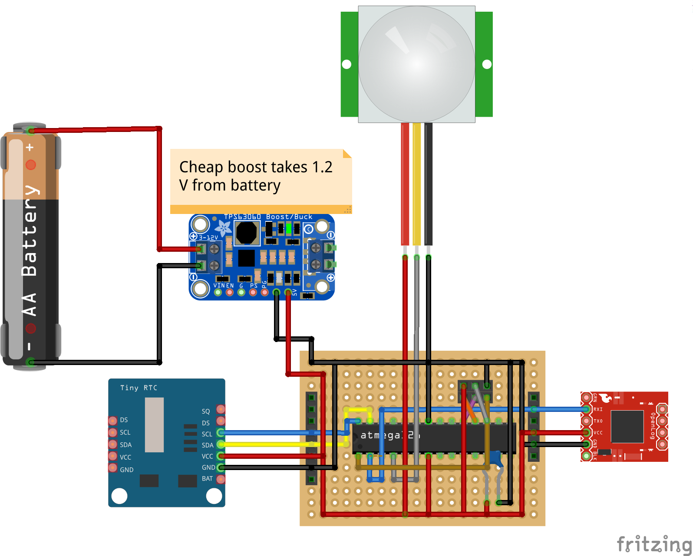
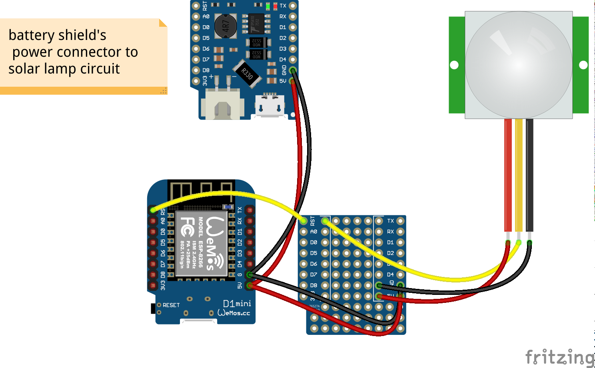
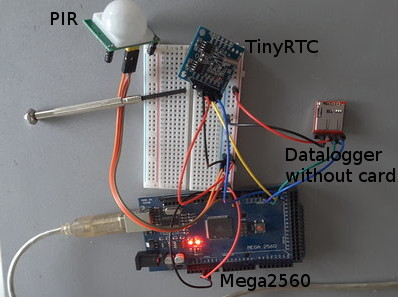

# bfc3000
##Watch and analyze your bird's eating habits

###Aim 
Writing a time stamp over multi week time frames. Timestamped entries are written by wild bird's setting off a motion
sensor. The timestamps are made up into some kind of diagrams or other visualization.
The device is power independent through piggybacking on a solar charged battery powered movement detection LED array.
Total cost should be below $50.

###Used hardware for Atmel 328 version
|Hardware|Note|Price|My Source|
|--------|-----------|----:|------|                                                                                                                                                                                                                  
|PIR sensor|low active so possible to mock with a push button |$1|[Aliexpress](http://www.aliexpress.com/item/1pcs-High-Quality-HC-SR501-Infrared-PIR-Motion-Sensor-Module-For-Arduino-Raspberry-pi/32558562655.html) |
|OpenLog & SD card|I had this lying around but any cheap copy is fine|$20|Sparkfun|                                                                                                                                       
|TinyRTC||$0.6|[Aliexpress](http://www.aliexpress.com/item/Free-shipping-20pcs-lot-The-Tiny-RTC-I2C-modules-24C32-memory-DS1307-clock-RTC-module-for/1876368739.html)|
|Atmel 328P|using the bare chip allows us to utilze the full potential of the power saving|$2||                                                                                                                                                      
|Solar lamp|a weather proof nice case and solar rechargable battery power supply|$3|[Aliexpress](http://www.aliexpress.com/item/New-Arrival-Solar-Power-Panel-6-LED-Light-Sensor-Waterproof-Outdoor-Fence-Garden-Pathway-Wall-Lamp/32456071230.html)|
|5V voltage boost||$1||
|100nf ceramic capacitor|For smoothing out the power spike during runtime|$0.1||                                                                                                                                                                     

Expect some soldering for the headers and connections.

###Used hardware for WeMos version
|Hardware|Note|Price|My Source|
|--------|-----------|----:|------|                                                                                                                                                                                                                  
|PIR sensor|low active so possible to mock with a push button |$1|[Aliexpress](http://www.aliexpress.com/item/1pcs-High-Quality-HC-SR501-Infrared-PIR-Motion-Sensor-Module-For-Arduino-Raspberry-pi/32558562655.html) |
|WeMos D1 ||$4|[Aliexpress](http://www.aliexpress.com/store/1331105) |
|WeMos battery shield |stackable with other WeMos parts|$2|[Aliexpress](http://www.aliexpress.com/store/1331105) |
|WeMos SD card reader shield|also stackable|$1|[Aliexpress](http://www.aliexpress.com/store/1331105) |
|Solar lamp|a weather proof nice case and solar rechargable battery power supply|$3|[Aliexpress](http://www.aliexpress.com/item/New-Arrival-Solar-Power-Panel-6-LED-Light-Sensor-Waterproof-Outdoor-Fence-Garden-Pathway-Wall-Lamp/32456071230.html)|

This is the improved hardware for this project. No need for a RTC as the WeMos seems to be pretty good at keeping time.
The wireless capability can be used to get the actual time from NTP. Even the Micro SD is not really necessary due
to pushing the data to some IoT service.

###Modifications to hardware, software and libs

####Parasitic casing and power source

Gut the solar LED lamp and solder a connector for easy access from the step up converter to 5V.
As the sensors utilize 5V I keep the power on two separate rails on my perfboard.

###Modifications to hardware, software and libs for 328 version

####Connector on base board

The OpenLog and TinyRTC modules are plugged directly from their female header into a male socket. This puts stability
and reduces cable clutter in the case.

####ICSP header

Even the small space on the board leaves some place for a 6 pin ICSP connector for later reprogramming.

####Using the on-chip 8 MHz oscillator

Some tweaking allow to save the external 16Mhz oscillator.
[This](https://www.arduino.cc/en/Tutorial/ArduinoToBreadboard) 
tutorial was tested successfully. There are sources claiming major power saving. No draw backs with this project as
there are not time critical libraries used.

####Firmware update for the OpenLog
Using [this instruction](https://learn.sparkfun.com/tutorials/openlog-hookup-guide) you should update to the newest
firmware. It is required to use full FAT32 formatted cards.

###Schematics for 328 version###
Downloadable from [this repository](bfc3000_atmega328.fzz). The software used is free and called [Fritzing](http://fritzing.org).
Not in best shape as there is only one board produced until now.

###Schematics for WeMos version###
Downloadable from [this repository](bfc3000_wemos.fzz).

###Prototype

Using an ATMEGA2560 for prototyping has the big improvement of multiple serial ports. One for debugging and other for
the devices, e.g. the OpenLog which communicates over Serial.

It was somewhat fuzzy to get the OpenLog going with my el-cheapo Chinese MicroSD. Firstly, the sensor was blinking
thrice (card error) with its default FAT32 system. I repartitioned to FAT16 and decreased the partition size. It worked
but the card was not removable during a power cycle.

The solution: a firmware update. You need some TTL converter like FTDI to USB or some 
[cheaper
version](http://www.aliexpress.com/item/Free-Shipping-1pcs-FT232RL-FTDI-USB-3-3V-5-5V-to-TTL-Serial-Adapter-Module/32481520135.htm).
Following [this instruction](https://learn.sparkfun.com/tutorials/openlog-hookup-guide) for reprogramming the on board Atmega328 is straight forward.
After flashing it flawlessly wrote to the full sized FAT32 partitioned card.

Putting the board into production was not considered due to the price limit of this project. After a manual setup on a
permaboard the author switched to a WeMos with shield. Reasons were the improved capabilities and some saved parts.

###Power supply
Due to its size and small expected power consumption it is fit to be powered by a 1.2V NiMh battery. For power
harvesting I reuse a small [solar powered lamp with an included rechargable
battery](http://www.aliexpress.com/item/New-Arrival-Solar-Power-Panel-6-LED-Light-Sensor-Waterproof-Outdoor-Fence-Garden-Pathway-Wall-Lamp/32456071230.html).
Quite nice for $3 as there is lavish space inside for my own sensors and the board. The casing seems
watertight. I put the step up converter in parallel to the battery and used some left over JST connectors.

###Power consumption during runtime
TBD

###Power consumption during sleep
TBD
